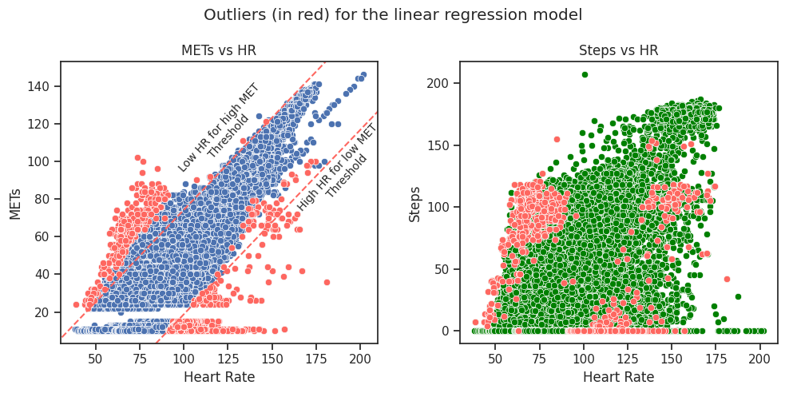

# BellaBeat

Is this study I analysed the public data of the FitBit trackers and suggested a feature improvement on automatic heart rate anomaly detection based on the existing data.

The following tools were used:
- Python
  - Pandas
  - Numpy
  - Matplotlib
  - SKLearn
  - Seaborn
  - TensorFlow

This study consists of 3 notebooks for convenience, the links below are on Kaggle and have the same code as on this repo:

- Part 1 - Data exploration and inspiration to the question  
    https://www.kaggle.com/code/kriggs/bellabeat-case-study-1-3-data-exploration

- Part 2 - Feature selection  
    https://www.kaggle.com/code/kriggs/bellabeat-case-study-2-3-feature-selection

- Part 3 - ML Modelling  
    https://www.kaggle.com/code/kriggs/bellabeat-case-study-3-3-ml-modelling

In these notebooks I go through:
- Statistical visualization of the data

- In depth look of the data

- Explanations

- Feature selection

- ML Modelling

- Model analysis

For the conclusions please check the last notebook.